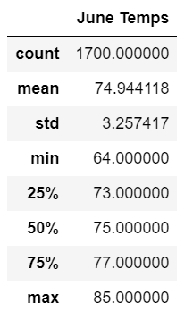
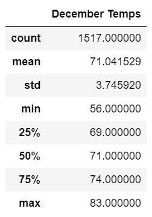

# Surfs Up
## Overview of Analysis
Statistical summers of temperature data for the months of June and December in Oahu were assessed to determine if the a surf and ice cream shop buisiness is sustainable year-round.  

SQLAlchemy is a Python SQL toolkit and Object Relational Mapper. In order to analyze the weather data, SQLAlchemy was used to query the SQLite database. 

# Results
- The mean temperature of 74.94°F for June was 3 degrees higher compared to the mean temperature of 71.04°F for December.
- The lowest recorded temperature for the month of June was 64°F while December was 56°F.
- The standard deviation is reported as 3.26 for June and 3.7 for December.

# Summary
- A surf and ice cream store in Oahu would be appropriate all year round even though the temperature is slightly lower in December.  The average temperatures for June and December is only different by 3 degrees with a similar standard deviation (3.26 for June and 3.7 for December.)
- Additional research can be done to further analyze if the store would be appropriate all year round. The following two queries could give additional insight:
    - Compare the precipitation difference between June and December to if one month has more rainy weather. People would be deterred to go to a surf and ice cream store if the weather conditions were not safe.
    - Assess other months' weather patterns too.  Since December and June were initially chosen to see how the weather was like during winter and summer, the months March and September can also provide a bigger picture of weather pattern on Oahu all year round.